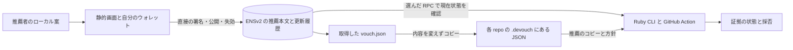

# Devouch：分散性を優先したデータ構造と保存場所

更新：2026-09-26。分散性を優先しWorld賞を条件付きにする設計を、推薦版として新規実装した。本書は保存場所と関係の説明。厳密な署名型・対応namespace・履歴契約は [v1検証契約](protocol.md)、実際の確認範囲は [実装状況](implementation-status.md)を優先する。

**推薦者が自分で署名して ENS へ公開し、検証者が chain から本文を取得する。各 repo が自分の方針で採否を決める。Devouch 運営者の発行 API・共通署名鍵・共有 DB を必要としない。**

## 1. 誰が管理し、どこへ保存するか

| データ | 保存場所 | 管理する人 | 検証・利用する人 |
|---|---|---|---|
| 作成途中の推薦案 | 推薦者の手元の `request.json`、操作画面のメモリ | 推薦者 | 推薦者が署名前に確認 |
| 推薦本文と署名 | ENSv2 の専用 resolver の text record | 推薦者自身 | 誰でも RPC 経由で取得し、ローカル検証 |
| 名前と resolver の対応、更新権限 | Sepolia 上の ENSv2 コントラクト | 各推薦者が持つ管理権 | CLI が公開先・参照先を照合 |
| 公開・失効の履歴 | chain の取引と `TextUpdated` 等のイベント | chain の記録として保持 | CLI が過去の公開と撤回を確認 |
| 推薦 JSON のコピー | 手元の `vouch.json`、GitHub repo の `.devouch/vouches/github-<ID>.json` | 推薦者が公開、貢献者が受け渡し、repo がレビューして保存 | CLI / Action が署名・対象・ENS の現在状態を検証。別 repo へ同じ JSON をコピー可能 |
| `publication.json` | 公開 tx / block の位置を保存する任意の手元・CI の一時ファイル | 利用者。CLI が chain から公開位置を求め、必要な場合だけ保存 | CLI が chain と再照合。信用の根拠は chain。repo 保存・Action への事前引き渡しは必須にしない |
| `policy.json` | 各 GitHub repo の `.devouch/policy.json` とそのローカル checkout | 各 repo のメンテナー | CLI が採否を判断。Action は PR の base commit から読む |
| 秘密鍵 | 推薦者自身のウォレット | 推薦者 | ウォレット内で署名・取引送信 |
| RPC 設定・作業データ | CLI の環境、CI runner のメモリ・一時 JSON | 各利用者 | 接続先は変更可能。以前の結果を現在値の代用にしない |
| 検証結果 | GitHub Actions の Summary、手元の JSON report | 各利用者 | 検証時点の結果。推薦の原本ではない |

静的 Web はファイルを読み、ウォレット操作を助ける画面で、発行の許可者や原本の保管者にはならない。画面はローカル起動・別ホストへの配置ができるものにする。

`.devouch/` には、Git で差分を読める通常の UTF-8 `.json` ファイルを保存する。CI の作業データはメモリと一時 JSON で扱う。



### GitHub repo のディレクトリ

```text
.devouch/
  policy.json                 # この repo が受け入れる推薦者・用途・公開先
  vouches/
    github-12345.json         # subject が github:12345 の公開済み推薦本文と署名
```

発行者が公開 JSON を配布し、貢献者は初回の PR に1ファイル追加する。取り込まれた後の PR では同じファイルを使い、別 repo でも再署名せずコピーできる。全推薦の検索サービスや、全員共通の GitHub repo は必須にしない。JSON のコピーは運営者が所有する repo に集めない。

Action は PR 作者の数値 ID に対応するファイルだけを PR の head commit から読む。ファイル名を信用せず、署名済みの `subject` と PR 作者を照合する。PR 作者と実行者・再実行者・Git author を区別する。repo の方針は base commit から取得し、その PR の方針変更を自己承認に使わせない。PR のコードは checkout・実行しない。

管理者本人名義と、エージェント自身の専用アカウント名義の両方を想定する。直接推薦の案では、前者の `subject` は管理者の GitHub ID、後者はエージェントの GitHub ID になる。両者にはそれぞれの推薦 JSON を使う。この構造だけでは管理者とエージェントの関係は証明せず、管理者への推薦も自動では引き継がない。[二つの送信名義](agent-operator-guide.md#二つの送信名義と推薦の対象)

本文を Git に置いても、ENS の値・署名・期限・履歴を検証する条件は変わらない。Git からの削除は repo 内の配布をやめる操作であり、全 repo 共通の失効ではない。ENS で失効させれば、古い JSON が Git に残っていても次の検証で受け入れない。今回の案では ENS にも本文を保存するため、GitHub のコピーだけが唯一の取得先になることはない。

Action の導入手順は [導入マニュアル](adoption-guide.md)、CLI を直接使うコマンドと入出力は [CLI インターフェース設計](cli-interface.md)を参照する。どちらも新しい推薦版の設計案である。

## 2. ENSv2 の役割

ENS の registry は名前を管理し、resolver は名前に紐づくデータを返す。text record には文字列を保存できる。ENSv2 の Permissioned Resolver は、特定キーだけの更新権限を渡すこともできる。[公式資料](https://docs.ens.domains/ensv2/permissioned-resolver/)

今回の案では `devouch.vouch` に**小さな推薦本文と署名を含む JSON 全体**を置く。前案のハッシュだけの保存では、本文を持つ中央サーバーへの依存が残った。この案では、検証者は ENS から本文も取り出せる。

推薦者自身が名・resolver の管理権を持つ。全員を Devouch 運営者の管理する resolver や親ドメインへ収容する構成は使わない。ENS の権限はこの resolver が扱う全名前へ届くため、独立した推薦者ごとに分ける。

ENS は World の結果や推薦の品質を判断しない。有効な推薦として認める条件は CLI が署名・公開状態・期限から検証し、採否は各 repo が決める。

### 既存コントラクトの利用とデプロイ

**今回の8時間版は、ENSv2 の既存実装を使い、Devouch 独自のスマートコントラクトを新規実装しない構成を想定する。** 新しく作る中心は CLI、Action、静的 Web と、推薦の形式・検証ルールである。既存版の `DevouchTrustRegistry` を、この推薦版のために作り直す必要はないという設計案である。

| 処理 | 担当と境界 |
|---|---|
| 推薦本文の公開・保存 | ENS の text record に署名付き JSON を保存する |
| 更新できるアドレスの管理 | Permissioned Resolver の権限で制御する |
| 推薦への同意と署名 | 推薦者のウォレットで署名し、CLI が既存の暗号ライブラリで検証する |
| 期限・対象・公開先の照合 | Devouch CLI が推薦と chain の状態を確認する |
| 失効 | 権限を持つアドレスが ENS の値を更新し、CLI が現在値と履歴から失効と判定する |
| repo ごとの採否 | CLI が各 repo の `policy.json` で判断する |

ENS の既存コントラクトが提供するのは、記録の読み書きと権限制御である。推薦 JSON の署名検証や期限、推薦の失効という意味は Devouch のルールで定義する。[Permissioned Resolver の仕様](https://docs.ens.domains/ensv2/permissioned-resolver/)

独自 Solidity を書かなくても、推薦者ごとの専用 resolver を用意するオンチェーン操作は必要になる。公式の構成では、Verifiable Factory から既存の実装コントラクトを参照する proxy を作り、`initialize` で権限などを設定し、名前の `setResolver` で紐付ける。[公式のデプロイ手順](https://docs.ens.domains/ensv2/permissioned-resolver/#deploying-a-permissioned-resolver)

初回の準備では、次を確認する。

1. 利用する Sepolia の公式 Factory・実装アドレス・ABI の版を固定する。
2. 推薦者が管理する専用 resolver をデプロイ・初期化する。利用可能な自分用の instance がある場合は、実装と権限を検証して再利用できる。
3. 名前との紐付けと記録を初期化し、record ID と履歴確認の開始 block を取得する。
4. 推薦者による直接の書き込み・読み取り・失効と、必要なガスを確認する。補助鍵を使う場合は権限の範囲も検証する。

この準備と公開・失効の取引は推薦者が行う。推薦を検証する repo ごとに resolver をデプロイする構成にはしない。CLI の `request` / `revoke` は未送信の案を作る操作なので、これらの準備や取引送信の完了を意味しない。[CLI の操作分担](cli-interface.md#1-利用者と操作の分担)

### 専用コントラクトを検討する条件

現在の案では「一度失効した推薦は、同じ JSON を再掲載しても受け入れない」を、CLI が履歴を調べて実現する。ENS 自体が同じ文字列の再書き込みを禁止する仕組みではない。

次のようなルールを、検証アプリ側の判断に加えてチェーン上でも強制する必要が出た場合は、専用コントラクトを検討する。

- 有効な推薦者署名を持つ推薦だけを登録できるようにする。
- 推薦 ID ごとの失効を記録し、同じ ID を再び有効にする更新を拒否する。
- 更新対象が想定した推薦のままである場合だけ失効させ、競合する更新による取り違えを防ぐ。

これらは初版へ追加する決定ではない。独自コントラクトには設計・テスト・デプロイ・保守が増えるため、8時間版では ENS の既存実装と CLI の検証を組み合わせる案を先に確かめる。複数推薦の同時保持も、独自コントラクトが直ちに必要という結論にはせず、記録の分け方を含めて別途設計する。

ENSv2 は Sepolia に公開されているが、仕様は未確定である。[公式 Overview](https://docs.ens.domains/ensv2/overview/)を参照し、着手時に利用する版を再確認する。今回の resolver のデプロイ・初期化、本文サイズ・ガス・実動作は未検証である。

## 3. 公開する推薦の構造

`vouch.json` と、ENS の text record に保存する文字列は、同じ推薦データである。次は構造例で、`<...>` は説明用の値。署名検証に使える完成サンプルではない。

```json
{
  "formatVersion": 1,
  "domain": {
    "name": "Devouch",
    "version": "1",
    "chainId": 11155111,
    "verifyingContract": "<推薦者が管理する resolver>"
  },
  "endorsement": {
    "message": {
      "version": "1",
      "id": "<新規の非ゼロbytes32、小文字hex>",
      "issuer": "<推薦者 A のウォレットアドレス>",
      "subject": "github:12345",
      "scope": "oss-contribution",
      "issuedAt": "<発行時刻>",
      "expiresAt": "<推薦の期限>",
      "requestNonce": "<ローカルで作る一度限りの乱数>",
      "recordName": "<推薦者が管理する ENS 名>",
      "resolver": "<推薦者が管理する resolver>",
      "recordId": "<初期化済み記録の番号>",
      "anchorStartBlock": "<履歴確認の開始 block>"
    },
    "signature": "<推薦者 A の EIP-712 署名>"
  }
}
```

| 部分 | 意味 |
|---|---|
| `domain` | 署名の用途・版・chain・resolver を限定する |
| `issuer` / `subject` | 推薦したウォレットと、推薦された送信アカウントの GitHub 数値 user ID。管理者本人またはエージェントの専用アカウント |
| `scope` | 建設的な OSS の協働相手としての推薦。個別コードの品質保証にはしない |
| `issuedAt` / `expiresAt` | 推薦の発行時刻と期限 |
| `id` / `requestNonce` | 推薦を識別する値とローカル乱数。運営者の要求 ID やセッションではない |
| `recordName` / `resolver` / `recordId` | 推薦の公開先を署名へ結びつける |
| `anchorStartBlock` | 古い推薦の再掲載を見逃さないための履歴確認開始地点 |
| `signature` | 推薦者が上の内容に同意したことをウォレットの公開アドレスで検証する |

時刻はuint64、recordIdとanchorStartBlockはuint256の10進文字列、idとrequestNonceはbytes32に固定した。詳細は [型の表](protocol.md#公開原本と署名)。repo IDやPR headを固定しないため、同じ推薦を別repoでも評価できる。

前案の `worldReceipt` とサービス署名はない。署名が正しいことだけでは人間性の証明にならず、基本構成の表示は `human_verification: not_included` とする。World を追加する場合は、この版とは別に検証可能な証拠と結び付けを設計する。

### ハッシュと原本

EIP-712 署名のための digest はライブラリで計算する。公開原本は JSON 全体であり、ENS に置く値は `sha256:<digest>` ではない。前案にあった二つのハッシュと検証サービスの受領証を組み合わせる仕組みは採用しない。

受け渡し・再検証では、chain から得た JSON の bytes をそのまま保存する。JSON の整形変更を、既に公開した推薦の更新として無言で送信しない。

## 4. ENS にある状態と公開位置

```text
Sepolia / ENSv2
  推薦者が管理する名前
    → 推薦者専用の resolver
      → recordId 7
        → text key: devouch.vouch
        → value: 推薦本文と署名を含む JSON 全体

  権限（公開アドレスとロール）
    推薦者のアドレス → 管理者・直接の公開と失効
    推薦者が選ぶ補助アドレス → 指定キーだけの更新（必要な場合）

  更新履歴
    recordId / key / 更新後の value / tx・block の位置
```

MVP は一つの記録・キーに、同時に一つの推薦を載せる。管理者とエージェントの名義の確認は、片方への発行・PR・失効の後、もう片方へ新しく発行して順番に行う。複数推薦を同時に保つ構成は別途設計する。同じキーへ別の推薦を置くことは、前の推薦を失効させる更新として扱う。Git の `.devouch/vouches/` に複数人の JSON を置くだけではこの制約は解消しない。一般の OSS への導入前に、複数推薦の公開先を設計する必要がある。

`publication.json` は、chain 上の公開を探す手がかりである。

```json
{
  "chainId": 11155111,
  "transactionHash": "<公開 tx の hash>",
  "blockNumber": "<公開 block の番号>",
  "blockHash": "<公開 block の hash>"
}
```

公開位置は推薦の署名対象に含めない。CLI は成功 receipt、該当 record / key のイベント、現在値を照合する。履歴の開始地点は推薦者が署名した `anchorStartBlock` を使い、補助ファイルで上書きさせない。

## 5. 発行・取得・失効の流れ

| 段階 | 推薦者の操作 | 公開データ | 検証者の操作 |
|---|---|---|---|
| 準備 | 自分の名・resolver を初期化し、CLI で案を作る | 名前・権限。推薦本文は未公開 | まだ推薦の公開として扱わない |
| 署名・公開 | 内容を確認して署名し、ウォレットから直接 JSON を書く | 本文・署名・公開イベント | receipt と readback を確認して取得 |
| 再利用 | 新しい認証・署名・chain 書き込みは不要 | 同じ推薦 | `.devouch/vouches/` へ同じ JSON を追加し、各 repo の方針で現在の状態を評価 |
| 失効 | 管理者または許可した補助鍵から値を空にする | 空の現在値と、過去の本文を含む履歴 | 以前の推薦を次の検証で `revoked` と判断 |
| 再発行 | 新しい ID・nonce・署名で公開する | 新しい推薦と履歴 | 古い署名の単なる再掲載は復活と認めない |

失効しても、chain の履歴から過去の本文が消えるわけではない。補助鍵の更新権限を外す操作と、発行済み推薦を失効させる操作も別である。

補助鍵を使う場合は、推薦者自身が選んで管理する。補助鍵に私たちのサービスや秘密鍵を必須にしない。補助鍵が停止しても管理者から直接失効できるようにする。

## 6. 各 repo が決めること

```json
{
  "repositoryId": "<OWNER/REPOSITORY>",
  "chainId": 11155111,
  "trustedIssuers": ["<推薦者 A のアドレス>"],
  "allowedScopes": ["oss-contribution"],
  "allowedResolvers": [
    {
      "address": "<推薦者 A の専用 resolver>",
      "implementation": "<確認した実装の識別情報>"
    }
  ],
  "requiredIssuers": 1
}
```

方針は各 repo のメンテナーが選ぶ。全利用者共通の推薦者登録 DB や `trustedWorldReceiptSigners` はない。ある repo の不採用は他の repo の採否や、推薦者の公開権限を変更しない。

`repositoryId` は実際の `OWNER/REPOSITORY` に置き換え、`.devouch/policy.json` に置く。Action は対象 repo とも照合する。resolver の実装識別情報の形式と、推薦者が配布する設定例の生成は未実装である。許可外 resolver の結果分類、公開期間中のリンク・実装変更、署名型・時刻などの未確定事項は [CLI の検証契約](cli-interface.md#未確定の検証契約)にまとめる。

## 7. 保存方式のトレードオフ

| 方法 | 利益 | 負担・今回の扱い |
|---|---|---|
| 小さい本文を ENS へ直接保存 | 取得のための専用 API・保管サービスを追加せず、公開状態と本文を一緒に読める | 書き込みガスと公開履歴が増える。8時間版の提案。アプリ上限4 KiBを目安に実データで確認 |
| 内容を外部へ分散保存し、ENS に参照を置く | 大きな本文を chain に保存するコストを減らせる | 複数の独立した保存者、保持期間、取得・検証を設計する必要がある。将来案 |
| 私たちの DB に本文を置き、ENS はハッシュだけ | 実装しやすい | 本文の取得と発行を運営者に依存させた前案。採用しない |

オンチェーン本文と公開 Git repo には GitHub ID と推薦関係が含まれ、撤回後も過去の内容が公開履歴に残る。ローカルの例は合成した対象を使う。実際の Action 検証は公開範囲を理解したテスト参加者の GitHub ID で行い、合成 ID を実在 PR 作者との照合成功として扱わない。

これは小規模デモの構成であり、推薦の大量発行・全文検索・全グラフの発見を実装するものではない。ENSv2 / Sepolia の実ガス、記録サイズ、readback は未検証である。

## 8. 停止・紛失時と残る依存

| 状況 | 扱い |
|---|---|
| Devouch の公開サイトが停止 | ローカル配布物または別ホストの同じ UI から署名・公開・失効する。運営者の承認 API は不要 |
| 手元の `vouch.json` を紛失 | 公開中なら ENS から再取得。失効後は既知の公開 tx / block とイベントから過去の本文を取得できる。RPC の履歴提供は必要 |
| 一つの RPC が停止・制限 | 利用者が別の接続先へ変更する。必要な状態・履歴を取得できなければ `unavailable` |
| 推薦者の秘密鍵を紛失 | 推薦の検証はできても、失効権限を回復できるとは限らない。Devouch 運営者に回復用の全体管理鍵を持たせない |
| ENS 名や resolver が差し替えられた | 署名済みの公開先と方針に照らし、不一致や未知の変更を通さない |

chain、ENS のプロトコル、名前の維持、ウォレット、RPC の正しい応答には依存する。World を追加した場合は、その発行・proof 要求・検証の依存も別途評価する。「オンチェーンに記録した」だけで全工程が運営者から独立したとは説明しない。

GitHub への依存も残る。Action は PR 作者や base / head commit を GitHub から取得し、推薦の `subject` は GitHub 数値 ID である。JSON を別の Git ホストへ移し、ENS の記録を読めても、移行先のアカウントとの対応は証明できない。他サービスでの利用には、その対応を検証する方法と投稿者情報を取得する連携が必要で、現在は未設計である。[Ghostty の離脱方針と Devouch への示唆](hackathon-research.md#ghostty-の-github-離脱方針と-vouch-の稼働)を参照する。

作業と検証条件は [ハンドオフ](hackathon-handoff.md)、World の追加条件と確認根拠は [調査メモ](hackathon-research.md#world-と分散性の追加確認)を参照する。
