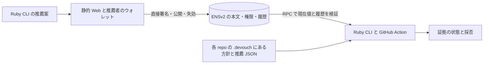

# Devouch：開発着手時のハンドオフプロンプト

設計時点：2026-09-25。以下は開発着手時の要件・完了条件の記録。2026-09-26にCLI・静的UI・Actionを新規実装し、ローカル通しテストを実施した。現在の契約は [protocol](protocol.md)、検証済み範囲と残作業は [実装状況](implementation-status.md)。**分散性優先、World賞は条件付き**の方針を維持している。実Sepolia・実fork PRの要件をローカル成功で置き換えない。

2026-09-26のユーザー訂正: **失効はPRでは検証しない。人間名義の実PR検証も今回の対象外とする。** 以下の旧計画にある失効後のAction再実行と両送信名義の実PR検証は完了条件から外す。PRでは有効推薦の照合までを確認し、masusanouのPRは [確認済み](demo-evidence.md#masusanouの実fork-pr)。ウォレット・CLIでの失効は別の確認範囲として記録する。

[データ構造と保存場所](hackathon-data-model.md)、[CLI インターフェース設計](cli-interface.md)、[受け入れ側の導入マニュアル案](adoption-guide.md)、[AI エージェント管理者向け送信マニュアル案](agent-operator-guide.md)、[企画の合意事項](hackathon-planning.md)、[公式資料の確認結果](hackathon-research.md)を併せて参照する。

---

あなたは Devouch のハッカソン版を実装するコーディングエージェントです。推薦の発行・失効・再利用を、Devouch 運営者の許可や常設サーバーに依存せず行える最小デモを完成させてください。

## 実行条件

- 作業先と開始時刻は着手時に指定・記録する。AGENTS.md と Git の差分を確認し、既存作業を保全する。
- ETHGlobal Tokyo 2026 / Building from Scratch。開発者1名＋コーディングエージェント。既存 Devouch のコードは当日の成果物へ流用しない。
- 実装8時間、提出素材4時間、ピッチ準備・本番4時間。実装超過で後二つの枠を消費しない。
- Ruby CLI が中心。導入者向けには GitHub Action を用意し、repo の設定と workflow だけで検証を始められることも必須にする。ENS「Best Use of ENSv2」を主な候補とし、World賞は分散性・公式要件・時間枠が両立した場合の追加候補とする。
- PR の送信名義は、管理者本人のアカウントとエージェント自身の専用 GitHub アカウントの両方を扱う。以下は、それぞれの PR 作者へ直接推薦を付ける実装案である。
- リモートの構造化ファイルは各 repo の `.devouch/` に通常の UTF-8 JSON として保存する。CI の作業データはメモリと一時 JSON で扱う。
- 指定先の可逆な実装・依存導入・テストを進める。公開、push、ホスティング、Sepolia の取引は、実行先と範囲についてそのセッションで与えられた承認に従う。既承認の操作を再承認させない。
- 秘密ファイルへのアクセス権を推測しない。秘密鍵や設定値を会話、ログ、リポジトリへ出さない。

このプロンプトは事前の検討案。使用した資料とコードの作成時期・再利用範囲を記録し、規約上の適格性を確認済みと扱わない。採用後は、この範囲の実装と検証を自律的に進める。

## 目的と優先順位

**OSS メンテナーが、誰からの貢献をレビューへ進めるか判断するための、持ち運べる推薦を作る。**

発案者の友人で Hono の開発者でもある yusukebe が AI Slop に悩まされていたことが動機の一つ。[本人の記事](https://zenn.dev/yusukebe/articles/3fd5bc6ea341c9)も踏まえ、メンテナーの時間と、貢献者を受け入れられる関係を守る。Hono / yusukebe が Devouch の導入・効果を承認したとは表現しない。

原典 [vouch](https://github.com/mitchellh/vouch)の貢献者への推薦と、各プロジェクトが採否を決めるモデルを尊重する。原典にもリポジトリ間の共有機能がある。追加価値は、発行者・用途・期限・撤回を独立に検証でき、運営者が止まっても発行・取得・失効できることに置く。

[Tea の調査](hackathon-research.md#tea-から確認できたこと)を踏まえ、投稿・登録・推薦数への報酬やランキングを作らない。推薦なしを悪質と同義にしない。推薦はコード品質やマージの保証ではない。

## 必ず守る分散性

1. 各推薦者が自分の署名鍵と、発行先の ENS 名・resolver の管理権を持つ。Devouch 運営者の発行者登録や承認を要求しない。
2. 推薦者がウォレットから直接公開・失効できる。私たちのサービス署名、共通 publisher 鍵、必須の中継 API を置かない。
3. 公開した推薦本文を chain から取得できる。運営者 DB のコピーだけを原本にしない。
4. CLI は署名と chain を自分で検証し、RPC の接続先を変更できる。各 repo が採否を決める。
5. Web は差し替え・ローカル起動できる静的な操作画面とする。私たちの公開サイトを止めても、別の配布物から発行・失効できることをデモで確認する。

ENS / Ethereum の仕組み、ウォレット、RPC、名前の維持費・ガスへの依存は残る。RPC や画面が差し替えられることを、信頼や可用性の問題が一切ないという意味にしない。

## 完成させるデモ

1. 推薦者が自分で管理する ENS 名と専用 resolver を用意する。私たちの親ドメインの管理権に依存する構成にしない。
2. CLI で GitHub の貢献者への推薦案をローカルに作る。
3. 静的 Web 画面へ案を読み込み、対象・用途・期限・公開範囲を確認し、推薦者のウォレットで署名する。
4. 推薦本文と署名を小さな JSON にまとめ、推薦者が ENS の text record へ直接書き込む。
5. 別の CLI 環境が ENS から JSON を取得する。同じ推薦を独立した二つの repo 方針で評価する。
6. 導入マニュアルの2ファイルを用意し、デモ repo の fork PR で Action を実行する。PR 作者への推薦 JSON を `.devouch/` から取得し、`valid / accepted` を Summary に表示する。手動の secret 登録や DB 準備を求めない。
7. 一方の repo 方針だけを変え、有効な推薦でもその repo は受け入れないことを CLI で示す。
8. 推薦者が直接失効させ、両方の CLI 検証と、手順6の Action の再実行で `revoked / not_evaluated` を確認する。Git に置いた推薦 JSON は同じものを使う。
9. 運営者の Web を使わず、ローカル配布物と別の RPC で取得・検証・操作できることを示す。失効後の本文取得には既知の公開位置を使い、再発行には新しい ID・nonce・署名を使う。
10. 推薦者が保有する補助ウォレットへ推薦キーだけの更新権限を与え、他キーへの更新拒否と権限の撤回を示す。

一人の推薦者、一つの用途、二つの repo 方針を使い、同時に有効な推薦は一人への一件に絞る。送信名義の確認は、管理者アカウントへの発行・実 fork PR・失効を確認した後、エージェントのアカウントへ新しく発行して同じ流れを繰り返す。両名義の PR と失効後の Action 再実行を通し確認し、一方だけの成功を両方の実証とは数えない。同時に二人の推薦を保つ機能は含めない。

実在 OSS への導入実績には見せない。ローカルの例は合成した ID を使えるが、実 PR の検証は公開範囲を理解したテスト参加者の GitHub ID で行う。合成 ID での fixture 成功を実 PR 作者との照合成功に数えない。

## 最小構成と保存場所

| 部分 | 担当 | 永続データ |
|---|---|---|
| Ruby CLI | 推薦案、取得、ローカル方針の評価、結果表示 | 自分の手元の JSON と repo 方針 |
| TypeScript 補助コマンド | `viem` による署名検証、ENS read、receipt / log の検査 | ローカルまたは CI のメモリ・一時 JSON。発行権限を持つサーバーにしない |
| GitHub Action | 必要なランタイムを用意し、PR 作者・JSON・repo 方針を Ruby CLI に渡して結果表示 | runner のメモリ・一時 JSON、Actions Summary |
| 静的 Web と利用者のウォレット | 内容確認、EIP-712 署名、直接の取引送信 | 鍵はウォレット。送信結果は利用者が保存可能 |
| ENSv2 / Sepolia | 公開した推薦 JSON、現在値、権限・更新履歴 | 各推薦者が管理する resolver と chain のイベント |
| 各 repo の `.devouch/` | 信頼する発行者・用途・公開先の指定、推薦の受け渡し | メンテナーが管理する `policy.json` と、公開済み推薦のコピー `vouches/github-<ID>.json` |

発行 API、World 検証サービスの受領証、共有 DB は基本構成に含めない。推薦本文と署名は ENS へ公開し、各 repo の `.devouch/` に配布用コピーと受け入れ方針を JSON で保存する。

Ruby の独自暗号実装を避けるため、CLI の実行には Bun と `viem` も必要になる案とし、README に明記する。Action はその準備を内包する。導入先の Gemfile / package.json や PR 内のスクリプトを実行して依存を準備しない。

## 推薦と ENS のデータ

対象は `github:<数値 user ID>`、推薦者は EOA アドレス。ウォレット署名の検証だけで、その利用者が World で確認された人間だとは表示しない。GitHub アカウントの所有権や個別 PR との対応も署名単体では証明しない。Action は GitHub が返す PR 作者の ID と subject を照合する。この照合も人間性や実際にコードを書いた主体の証明とは別である。

管理者本人名義なら管理者の ID、エージェント自身の名義ならエージェントの ID への推薦を照合する。管理者への推薦を別 ID のエージェントの推薦として使わない。この直接推薦は管理関係の証明ではなく、委任の追加を決めたものでもない。App の Bot ID だけから、その管理者や導入先を同定できると仮定しない。

推薦の EIP-712 型には `version`、ランダムな `id`、`issuer`、`subject`、`scope`、`issuedAt`、`expiresAt`、`requestNonce`、`recordName`、`resolver`、`recordId`、`anchorStartBlock` を含める。domain は Devouch 用の名前・版・Sepolia chain ID・resolver address を固定する。型・正規化・暗号処理は既存ライブラリを使う。

`scope` は `oss-contribution`、意味は「建設的に協働できる貢献者としての推薦」とする。repo ID や PR head は署名へ固定しない。同じ署名を別 repo の方針でも評価する。

**`devouch.vouch` の値には、小さな推薦本文と推薦者の署名を含む JSON 全体を保存する。** 前案の `sha256:<digest>` だけを保存する形式とは異なり、CLI が ENS から本文を取得できる。World のサービス署名・受領証は入れない。旧案との形式互換を仮定しない。

初版のアプリ側サイズ上限は4 KiBを案とし、実際の小さなデータでガスを見積もる。これは ENS の標準上限ではない。全文保存には書き込みコストがあり、GitHub ID・推薦関係・署名・過去の内容は公開履歴に残る。署名前と送信前に利用者へ明示し、デモ用データで確認する。

大量の推薦を扱う場合の content-addressed storage は将来案。IPFS 等に変えるだけで、保存・取得の運営者依存が解消したとは扱わない。初版でサイズやガスが成立しなければ問題を報告し、中央 DB へ無言で戻さない。

## ENSv2 の公開・権限・失効

公式 [Permissioned Resolver](https://docs.ens.domains/ensv2/permissioned-resolver/)の text record を使い、有効・失効という意味付けは Devouch が定義する。

初版は ENSv2 の既存実装を利用し、Devouch 独自の推薦台帳コントラクトを新規実装しない案とする。推薦者専用 resolver のデプロイ・初期化と名前への紐付けは必要であり、公式 Factory と実装を利用する。既に利用可能な自分用 instance がある場合は、実装・権限を検証する。手順と責任分担は [既存コントラクトの利用とデプロイ](hackathon-data-model.md#既存コントラクトの利用とデプロイ)を参照する。

- 推薦者自身が名・resolver の管理権を持つ。専用 resolver を使い、全推薦者共通の管理者鍵を置かない。
- 補助の更新鍵を使う場合も推薦者が管理し、`devouch.vouch` の setter 権限だけを与える。この権限は同じ resolver の全名前に及ぶため、独立した推薦者を混在させない。
- 更新鍵が書けても、推薦者の有効な署名がなければ CLI は推薦を認めない。更新権限と信用は別である。
- 公式 deployment の ABI・proxy・実装の組を着手時に固定する。調査時の参照ソースは `71a3b7339dbc55ab47667abdfe8303bac4f4c24e`。この版の `setText` は DNS encoded name、キー単位付与は `grantSetterRoles` を使う。
- 名前・記録を初期化し、record ID と開始 block を取得してから署名する。default record や record linking を意図せず使わない。
- 公開は tx receipt の成功、該当イベント、readback の一致まで確認する。tx hash の取得だけで成功表示しない。

失効は、その record / key の値を空にする取引。管理者が直接操作でき、補助鍵や Web 運営者の承認を不要にする。補助鍵の権限を取り消す操作だけでは、既に公開した推薦は消えない。

署名した `anchorStartBlock` から同じ resolver / record / key の `TextUpdated` を取得し、block・transaction・log の順に確認する。最初の該当 JSON の公開後、空値または異なる内容へ更新された推薦は失効を維持する。古い署名済み JSON を再掲載しても復活させず、再発行は新しい ID・nonce・署名を要求する。一つのキーを使う MVP なので、新しい推薦への置換は古い推薦の失効になる。

この復活拒否は CLI の検証ルールであり、ENS が再書き込みを禁止するという意味ではない。署名検証・永久失効・条件付き更新を chain 上で強制する追加コントラクトは将来の検討対象とし、初版へ無条件に追加しない。

この制約は Git に複数人の JSON を置いても解消しない。一般の OSS で複数人を推薦するには公開先を拡張する設計が必要であり、初版の一般運用が完成したとは主張しない。

名前・resolver・record ID・実装版の不一致や未知のリンク・upgrade を推測で通さない。全 read を一つの snapshot block にそろえ、chain ID、block number / hash、検証時刻を示す。必要な履歴を取得できない場合は `unavailable`。RPC の差し替えと取得範囲の分割を可能にし、巨大な検索サービスは作らない。

ただし、`TextUpdated` と現在値だけでは、途中の record の再リンクや proxy の実装変更を見落とさないことまで証明できない。必要な履歴と確認方法、対応外 resolver の結果分類は [未確定の検証契約](cli-interface.md#未確定の検証契約)に残る。上記の拒否要件を実装済みのアルゴリズムとは扱わない。

## CLI と Web の操作案

引数・入出力・エラーの詳細は [CLI インターフェース設計](cli-interface.md)を採用候補にする。CLI を直接使う導線と Action の導線を用意し、ローカルの対象指定を GitHub の PR 作者確認と同一視しない。

- `devouch request --subject github:12345 --issuer ISSUER --name NAME --expires-at 2026-10-01T00:00:00Z --output request.json`：初期化済み ENS の情報とローカル nonce を含む署名案を作る。
- Web で `request.json` を読み込み、署名と公開をそれぞれウォレットで確認する。Web が推薦内容を変更したら、再表示・再署名が必要。
- `devouch fetch --name NAME --output vouch.json`：ENS の公開値を直接取得する。任意の `--publication-output publication.json` で照合済みの公開位置も保存する。
- `devouch verify --credential vouch.json --policy repo-a.json --subject github:12345 --json`：ローカルの署名検証と現在の chain 状態、repo 方針、検証したい対象を照合する。`--publication` は任意の探索補助とし、省略時は署名済みの公開先と開始 block から照合する。CI では PR 作者から得た subject を必須にする。
- `devouch revoke --credential vouch.json --output revoke-request.json`：対象を固定した失効操作案を作る。CLI の成功は未送信の案の保存までで、Web / ウォレットから直接送信する。

`vouch.json` は chain にもある公開本文のコピー。`publication.json` は公開 tx / block の手がかりであり、信用の根拠としては chain から再検証する。現在値が空の場合、`fetch --publication publication.json` で既知の公開位置とイベントから過去の本文を取得できる経路を用意する。全推薦の検索や発見は MVP の機能にしない。

Web のライブデモは署名・公開・失効と公開値の閲覧を担当し、repo 方針の最終評価は Ruby CLI が行う。暗号・ENS 検証の補助部分を共有し、Web だけで別の採否ルールを作らない。静的配布物は利用者自身でローカル起動できるようにする。

公開 JSON は `github-<ID>.json` としてダウンロードできるようにし、導入者が内容を編集せず `.devouch/vouches/` へ置ける形にする。推薦者の EOA・resolver・検証した実装の情報を含む設定例も出力する。秘密を含めず、コピー元を信用するだけで推薦者を自動採用する機能にはしない。

取引が結果不明になったらウォレットの取引履歴と chain の receipt を照合する。同じ操作を新しい nonce で無条件に再送しない。取引の回復記録は利用者の手元に保存できるが、共有 DB や発行の許可リストにはしない。

## GitHub Actions からの導入

[導入マニュアル](adoption-guide.md)の手順を受け入れ条件にする。記載した Action の配布先・SHA・入力は未実装の案なので、実装後に実物へ置き換える。既存の委任・Git 来歴版 Action の入力をそのまま流用できると扱わない。

- メンテナーが追加するのは `.devouch/policy.json` と `.github/workflows/devouch.yml`。推薦された貢献者は初回だけ `.devouch/vouches/github-<ID>.json` を追加する。同じ JSON を他 repo へコピーして再利用できる。
- 最小の入力は `policy-path`、`mode: report`、GitHub の実行用 `github-token`。任意で `rpc-url` を変更できる。認証不要で必要な履歴を読める既定 RPC を検証し、利用制限・失敗時の表示を記録する。手動 secret、PAT、ウォレット、DB、常設サーバーを導入先の必須条件にしない。
- `pull_request` で動かし、token の権限は `contents: read` と `pull-requests: read` だけにする。公開 repo と fork PR を対象とし、GitHub の実行承認・組織制限を迂回しない。
- PR 作者の数値 user ID と対象 repo / PR / base SHA / head SHA を GitHub のイベント・API から取得する。`github.actor`、再実行者、PR 本文の自己申告を推薦対象にしない。再実行で元のイベントと異なる head の JSON を混ぜない。
- policy は base repo の指定 base SHA、推薦ファイルは指定 head SHA から GitHub API で読み取る。PR の checkout・コード実行・依存インストールをしない。取得対象は作者に対応する JSON に限定し、サイズ・履歴探索の予算・タイムアウトを制限する。
- 公開位置は CLI が署名済みの公開先と開始 block から chain を照合して求める。Action に `publication.json` の事前生成・引き渡しは必須にせず、補助ファイルを保存する場合も信用の根拠にはしない。導入者に tx hash の転記や、常設 indexer を求めない。必要な範囲を照会した結果、公開がなければ `missing`、照会を完了できなければ `unavailable` にする。
- report は証拠と採否を表示する。CLI の判定終了コード 0 / 1 / 2 を表示用に扱い、処理完了と推薦採用を区別する。取得不能・設定不備・Action エラーは失敗にする。全失敗を `continue-on-error` で隠さない。
- Summary には PR・対象・issuer・採否・理由・chain / block / 検証時刻・使用した policy と verifier の識別情報を出す。token や認証付き URL は出さない。
- この版では自動マージ・自動クローズ・required check による強制を作らない。`pull_request` の workflow 自体を PR が変更できる境界と、失効だけでは過去の check が更新されない点を導入者に説明する。既存 run の再実行は chain の現在状態を読み直す。

Action は CLI を呼ぶ実行場所の一つであり、GitHub 以外ではローカル CLI から同じ証拠を検証できる。Git に残る古い JSON を、ENS の現在状態より優先しない。Git の削除と全 repo 共通の失効を混同しない。

## 結果とテスト

JSON は `evidence_status`、`policy_status`、`reason_codes`、`subject`、`issuer`、`scope`、`snapshot` を分ける。World proof を含まない基本構成では `human_verification: not_included` とし、人間性確認済みと表示しない。

| 場合 | 証拠 / 方針 | 終了コード |
|---|---|---:|
| 証拠が有効で方針を満たす | valid / accepted | 0 |
| 未信頼の発行者・用途不一致 | valid / rejected | 1 |
| 失効・期限切れ・署名不正・未公開 | revoked / expired / invalid / missing、方針は not_evaluated | 2 |
| RPC や履歴を確認できない | unavailable / not_evaluated | 3 |

利用・設定・実行環境のエラーは `4`、ファイル操作のエラーは `5`、予期しない内部エラーは `70` とする案。機械向け JSON、案の作成・取得コマンドの終了コード、対象ファイルがない場合の分類は [CLI の出力契約](cli-interface.md#7-json-出力と終了コード)に従う。推薦の受け入れを、コードの安全性やマージの許可へ読み替えない。

Ruby は Minitest で test-first、補助部分は Bun の振る舞いテストを使う。実装のコピーになったテストは増やさない。

| 境界 | 必須確認 |
|---|---|
| 署名・入力 | 対象・期限・用途・ENS domain の改変、他者署名、破損 JSON、過大入力、World 未確認表示 |
| ENS | 実書き込み・readback、別 chain / resolver / record、未公開、失効、旧 JSON の再掲載、履歴不足 |
| 権限 | 推薦者が直接操作できること、補助鍵の他キー更新拒否、補助鍵を外しても管理者が失効できること |
| 方針 | 同じ推薦を二つの repo で採用、一方だけ拒否、入力からの方針上書き拒否 |
| Action | 実 fork PR、手動 secret なし、PR 作者と実行者が別、他人の推薦、base policy 固定、PR コードの非実行、失効後の再実行、report の処理完了と採否の区別 |
| 送信名義 | 管理者とエージェントの各アカウントへ順番に推薦を発行し、両方の実 fork PR で照合。エージェントの PR に管理者の推薦だけを添えても通さず、管理関係の確認済み表示もしない |
| 運営者への依存 | 私たちのサイトを使わずローカル UI から発行・失効、別 CLI から取得、RPC を切り替えて検証 |
| 回復 | ウォレット拒否、結果不明、再起動、公開済み本文の chain からの再取得、秘密鍵の不出力 |

## 8時間の実行順序

時間は実装開始からの経過。各タスクは先に受け入れ条件と失敗するテストを置く。所要時間は見積もりであり、公式資料を読んだだけで成功扱いしない。

| 時間 | 作業 | 完了条件 |
|---|---|---|
| 0:00–0:15 | 新規作業先、実行条件、ウォレット・RPC・デモ名を確認 | ローカルの test harness と外部条件の一覧 |
| 0:15–1:30 | ENS の専用 resolver、直接書き込み、キー権限、小さな JSON のガス確認 | 実書き込み・readback・権限外拒否。使用 ABI / 実装を記録 |
| 1:30–2:45 | 推薦の型、CLI の案作成、静的 Web のウォレット署名・公開 | 署名付き JSON が chain から取得できる |
| 2:45–4:00 | Ruby の取得・検証・二つの方針 | 証拠と採否を分けた出力、改変等の否定テスト |
| 4:00–5:00 | 直接失効、履歴照合、旧推薦の復活拒否 | 両方針で失効。補助鍵なしでも管理者が操作できる |
| 5:00–6:15 | Action の梱包、PR と JSON の取得、CI 用推薦の新規発行、手順どおりの導入 | 2設定ファイルと有効な推薦 JSON、secret 登録なしで fork PR の結果を表示。開発テストで失効させた JSON は再掲載しない |
| 6:15–7:30 | 静的画面・ローカル配布、別 RPC・運営者不在、両送信名義・失効後の CI 再検証 | 両名義の実 Action、必須ケース、`rake test`、`rake lint`、補助 test / typecheck |
| 7:30–8:00 | 新機能を止め、ガス・復旧・実際の配布 SHA・導入手順を記録 | 導入マニュアルのプレースホルダーを実物に更新、提出素材への引き継ぎ |

2時間で ENS の基本操作が通らなければ、未達条件と原因を報告して範囲を再判断する。中央サービスに戻して成功扱いしない。遅れたら高度な UI、複数推薦者の管理画面、World の追加統合から削る。署名・失効・再利用・運営者不在での操作確認と、Action からの最小導入は削らない。Action を追加した分、静的 UI の仕上げ時間を縮めた見積もりであり、未達は提出・ピッチの時間へ繰り越して隠さない。

両送信名義の確認は上の枠内で順番に行う計画であり、8時間内の実現性は未測定。どちらかが未確認なら、その名義の通し確認を未達として記録する。

## World を追加できる条件

World賞は条件付き。基本経路が完成しても、残り時間だけを理由に未検証の認証を足さない。追加するなら、proof の要求から検証までの運営者依存、署名者と操作への結び付け、対応 chain / credential、実イベント要件を確認する。

公式のオンチェーン検証経路はあるが、現行 IDKit の要求署名や Agents の confidential client の扱いも解決する必要がある。[確認した範囲](hackathon-research.md#world-と分散性の追加確認)を参照する。IDKit の利用だけで Agents 賞に適合したと扱わない。

私たちのサービスが唯一の発行許可者・proof 要求者・検証結果の署名者になる案は採用しない。共通 secret をブラウザへ配布する回避策も使わない。成立しなければ World は未実装と明示し、World賞への応募を前提にしない。

## 提出・ピッチと未確認事項

静的ライブ URL、公開コードとライセンス、ローカル起動手順を用意する。秘密を持たないホスティング先は差し替え可能にし、閲覧だけのモックを動作デモとして扱わない。

提出素材4時間は README・出典・AI 利用・事前資料の区別に1時間、動画・構成図に1.5時間、URLと賞要件の照合に1時間、提出・表示確認に0.5時間。World を実際に統合した場合のみ、初回成功までの時間・摩擦・改善案を記録する。

ピッチ4時間は台本・最小スライド1時間、実機リハーサルと質疑2時間、本番・調整1時間を目安にする。友人のメンテナーの負担から始め、発行・二つの方針・失効・運営者不在での操作を示す。未測定のレビュー時間削減や実在 OSS の採用を主張しない。

確認した提出締切は **2026-09-27 09:00 JST**。動画は任意・推奨の2〜4分、Finalist はデモ4分＋質疑3分。最大3パートナーへの応募と、同一パートナー内での重複受賞を混同しない。[募集](https://ethglobal.com/events/tokyo2026/prizes)、[提出ガイド](https://ethglobal.com/events/tokyo2026/info/details)、[規約](https://ethglobal.com/rules)

現時点で未確認なのは、実際の ENS 名・ウォレット・ガス・ABI の一致、公開先、実認証と賞への適合である。完了報告では動くコマンド、live URL、テスト、chain の確認証拠、運営者なしでできた操作、未実装、Git と公開の状態を分けて示す。
